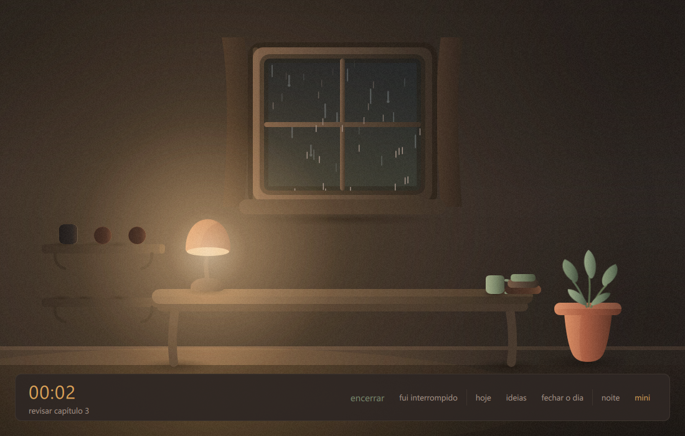
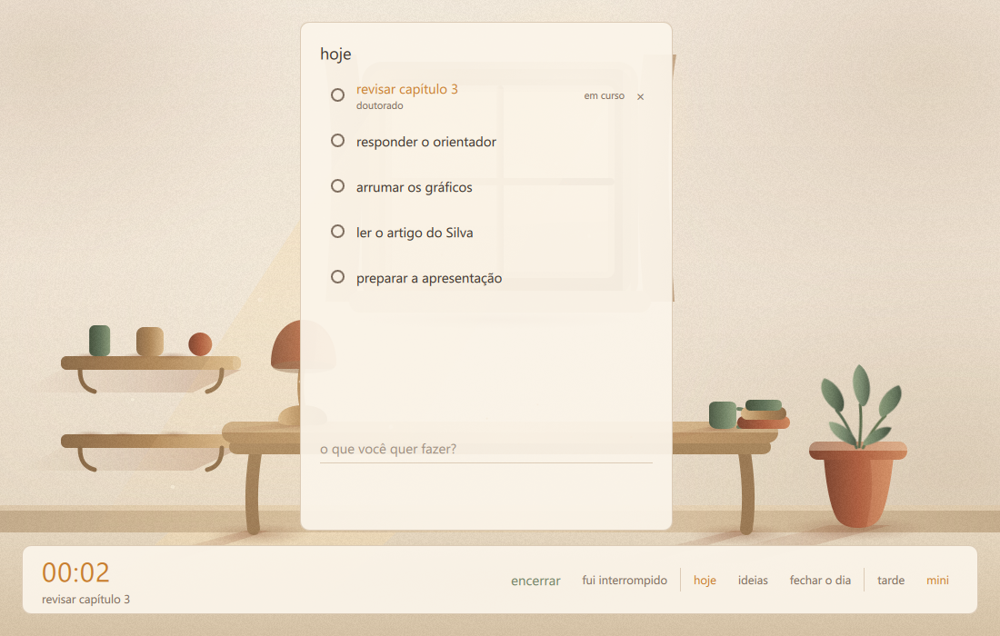

# Cantinho

Um cômodo ilustrado que fica aberto enquanto você trabalha.

O timer é o motor de tudo. Ele alimenta um diário que se escreve sozinho, e
cada tarefa que você conclui deixa um objeto na estante. A planta no canto
cresce com as horas de foco das últimas duas semanas — e murcha sozinha se
você sumir, sem drama e sem cobrança.



## O que ele não faz

Isso é metade do projeto, então vale dizer antes.

Não tem streak. Não tem barra de progresso, percentual, XP nem ranking. Não
tem gráfico na tela principal, nem notificação lembrando que você não abriu
ontem. Falhar não destrói nada — só não faz crescer.

Não tem conta, não tem nuvem, não tem sincronização e não manda nada para
lugar nenhum. O banco é um arquivo na sua máquina.

## Os dois momentos

O tema acompanha o relógio: claro de dia, escuro à noite, com uma travessia de
três segundos entre um e outro. Nunca corta seco.



## Rodando

Precisa de Python 3.10 ou mais novo. A única dependência de execução é o
PySide6.

```bash
python -m venv .venv
.venv\Scripts\Activate.ps1        # Windows
source .venv/bin/activate         # Linux

pip install -r requirements.txt
python -m cantinho.main
```

O banco fica em `%APPDATA%\Cantinho` no Windows e `~/.local/share/cantinho` no
Linux. Para experimentar sem sujar seus dados de verdade:

```bash
python -m cantinho.main --db ./teste.db --log DEBUG
```

### Como se usa

| | |
|---|---|
| **hoje** | escreva no campo de baixo e aperte Enter. Arraste para reordenar. |
| **começar** | prende o timer a uma tarefa. Ou clique em "começar" na barra para uma sessão solta. |
| **o círculo** | conclui a tarefa. É o que põe um objeto na estante. |
| **Ctrl+Shift+C** | guarda uma ideia de qualquer lugar, mesmo com o app escondido. |
| **fechar o dia** | a retrospectiva já vem montada das suas sessões. Você só diz como estava. |
| **mini** | uma janelinha só com o timer, sempre por cima. Arrasta pelo corpo. |

Fechar a janela não encerra o app: ele continua na bandeja, ao lado do relógio.

## Executável portátil

Para o pendrive, para a máquina do trabalho, para onde não dá para instalar
nada:

```bash
pip install -r requirements-dev.txt
pyinstaller cantinho.spec --noconfirm
```

Sai uma pasta `dist/Cantinho/` de uns 200 MB que roda sem instalação e sem
admin. O build é por plataforma: o do Windows não serve no Linux e vice-versa.

## Desenvolvimento

```bash
pip install -r requirements-dev.txt

python -m pytest              # 189 testes, sem abrir janela
python tools/simular_uso.py   # percorre a interface clicando de verdade
python tools/check_svg.py     # rasteriza os SVGs em build/svg_check/
python tools/gerar_audio.py   # regera os loops de ambiente
```

O `pytest` não cobre o QML. Quem faz isso é o `simular_uso.py`: ele abre as
janelas, cria tarefa, roda sessão, arrasta, captura ideia e fecha o dia com
mouse e teclado sintéticos, depois reabre o banco do zero e confere o log
evento por evento. Rode depois de mexer em qualquer `.qml`.

### Por dentro

Só existe uma tabela, `events`, e ela só recebe `INSERT`. Backlog, sessões,
estante, planta e histórico não são guardados: são recalculados a partir do log
toda vez, por funções puras. Corrigir alguma coisa é acrescentar um evento
novo, nunca editar o que já passou.

Isso significa que o estado da tela nunca pode divergir do que está em disco —
e que apagar o arquivo de banco é a única forma de perder alguma coisa.

```
cantinho/
  core/       events.py store.py projections.py clock.py   (sem Qt)
  services/   scene.py timer.py audio.py hotkey.py tray.py (plataforma)
  backend.py  a fronteira entre o log e a interface
  ui/         Main.qml Mini.qml theme/ room/ panels/
```

O som de ambiente é sintetizado, não gravado: `tools/gerar_audio.py` monta
chuva, acorde e estalo de vinil com a biblioteca padrão do Python. Os SVGs do
cenário têm camadas com os mesmos ids nos dois temas, o que deixa a planta e a
estante mudarem sem redesenhar o quarto.

`CLAUDE.md` tem as regras de arquitetura em detalhe, incluindo o que
deliberadamente não se faz aqui e por quê.
